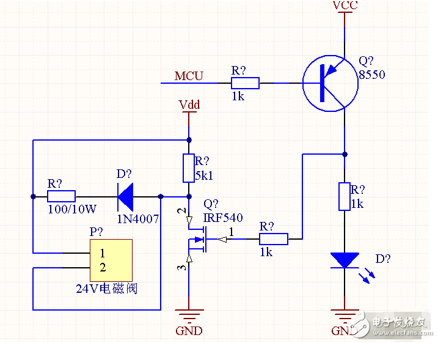

# 智能车视觉组仓库

第17届智能车竞赛-AHSTU-视觉小白队

视频：[【智能车】大二小白参加17届智能视觉组记录 开源_哔哩哔哩_bilibili](https://www.bilibili.com/video/BV1rY4y1u77a/)

## 目录说明:cactus:

- **[rt1064_rtt](\RT1064_RTT)**内是rt1064的工程
- **openart**部分是两个openart的代码
- **hardware**内有电机驱动以及母版的pcb文件

## 更新日志:rabbit:

2023-1-31

> 把文件重新整理了一下

2022-6-27

> 移植到RTT

2022-6-24

> 移植图像处理算法

2022-5-11

> 摸鱼

2022-5-6

> 1. 给Z轴加上了位置式PID，效果不错
> 2. 使用了泽坤写的路径规划V1.0，效果不错
> 3. 停车没写好，要写一个无论在什么位置，返回原点的函数。

2022-5-4

> 1. 还是用回了原来计算速度的公式，用角度算
>
> 2. 开始调摄像头
>
> 3. ```c
>        //新的位移计算公式参数
>        Car.MileageX+=detax*0.0095;
>        Car.MileageY+=detay*0.0086;
>    ```

2022-5-3

> 1. 路劲规划算法已整合完毕，编译通过。
>
> 1. 跟改了位移计算方式由之前的角度求解出目标位移改为了直接对分速度的积分求解。
>
> 2. ```c
>    //三角函数法计算速度公式：
>    Car_Omni(((float)speed_tar * sin(Car.Angel_Target/180 *PI)),((float)speed_tar * cos(Car.Angel_Target/180 *PI)),0);
>    Car.Distance=20*sqrt((Car.x-Car.x1)*(Car.x-Car.x1)+(Car.y-Car.y1)*(Car.y-Car.y1));
>    ```

2022-4-2

> 1. 硬件万事俱备，开始专注写BUG :-)，今天第一次尝试用回流焊，焊接了两块电机驱动板，虽然一开始并没有成功，经过调试之后，效果还是不错的，板子焊完比较干净，全程都很优雅。
> 2. 加入了PID控制，也学会了`RT1064`的中断操作，还没有调参，打算明天搞定VOFA+上位机！
> 3. PID调试中，应该先调整`I`的值，这个值和时间积分有关（个人理解）越大变化越快，然后再调`P`，这个值和能否快速回到目标速度有关。

2022-4-3

> 1. 搞定了VOFA+上位机，显示出来了波形
> 1. 增加按键，目前按键的功能是调目标速度
> 2. 调了PID的参数，可能还不太准确，但是比之前盲调要好多了
> 2. 明天打算搞定滤波和位置环

2022-4-4

> 1. 加入了低通滤波，但是好像没有什么效果。
>
> 2. 重新调整了`PID`参数
>
>    ```c
>    //记录PID系数
>    float Position_KP =150;
>    float Position_KI =20;
>    float Position_KD =0;
>    ```
>

2022-4-5

> 电机PWM阈值不能太高，之前设的50000，今天玩弄电机的时候冒烟了，吓得赶紧把阈值设置为了25000

2022-4-6

>  昨天调icm的驱动，有点难搞哦

2022-4-8

> 1. 计算位移公式：`Car.mileage=(Encoder/1024)*(45/104)*2*PI*0.03;`
> 2. 写小车行进模式函数

2022-4-9

> 去掉上拉电阻R26和R29好像可以解决小车上电一个电机猛转的问题

2022-4-14

> 这几天把小车的母版画了一下，还差电磁铁电路

2022-4-15 ~ 2022-4-26

> LJ躺平+摸鱼

2022-4-27

> 今天在操场碰到一个别的学校做越野组的大佬，非常厉害，完赛了，而且才大一！

2022-4-28

> 第一次跑点，目前还很抖，要加串级PID，而且方向还有问题。

2022-4-29

> 换了一种方式跑点，效果还不错，就是要加上姿态传感器闭环才行。

## 备忘录:notebook:

- 先用杰哥的车验证方案（3-12-直接放弃了）
- 5月前要完成小车麦克纳木轮的闭环驱动，IMU驱动整合，apriltag定位
- 项目总体计划：先搞定A4纸识别部分，然后搞定定位部分，最后想好要不要搞定搬运部分
- 非常感谢王乐老师愿意给我们买车模和元件
- 目前想了两种运动方式：一种是先转向再使用前进冲过去；另一种是车头永远朝前，利用麦克纳木轮的运动学逆解“螃蟹走步过去”

### 1、OpenArt透视变换（未解决）

1. [find_rects 识别矩形 · OpenMV中文入门教程](https://book.openmv.cc/example/09-Feature-Detection/find-rects.html)、透视变换[教程](https://book.openmv.cc/example/04-Image-Filters/perspective-correction.html)
2. 4-2 已经提交了issu并[得到回复](https://github.com/NXPmicro/OpenART/tree/dev)，有希望能解决openart透视变换函数报错问题，但是我不会编译OpenArt的固件:cry:-

### 2、麦轮转向


### 3、电磁铁驱动电路设计

> 参考：[单片机5V输出怎么样去驱动一个24V的电磁阀？ - 嵌入式设计应用 - 电子发烧友网 (elecfans.com)](http://www.elecfans.com/emb/app/20171127587352.html)



> ### 参考链接🔗
>
> 1. [第16届智能车智能视觉组-上海交通大学AuTop战队开源汇总 - 知乎 (zhihu.com)](https://zhuanlan.zhihu.com/p/391252945)
> 2. [恩智浦AI视觉组入门教程发布--逐飞科技](https://mp.weixin.qq.com/s/y90pT2_g0IPRuaNQPzZUqg)
> 3. [智能车竞赛AI组OpenART mini视觉传感器图像识别模块Open ART逐飞-淘宝网](https://item.taobao.com/item.htm?spm=a1z10.5-c.w4002-22508770847.38.3f9d5f26PVLIVv&id=637029649233&mt=)
> 4. [恩智浦AI视觉组浅析--逐飞科技 ](https://mp.weixin.qq.com/s/y2IzQTzd_mr4BtPH-oOKcQ)
> 5. [智能视觉组比赛细则](https://bj.bcebos.com/cdstm-hyetecforthesmartcar-bucket/source/doc-2kd6k14jliw0.pdf)
> 6. [智能视觉组补充说明](https://bj.bcebos.com/cdstm-hyetecforthesmartcar-bucket/source/doc-888jo99kh9g0.pdf)
> 7. [17界比赛总规则](https://bj.bcebos.com/cdstm-hyetecforthesmartcar-bucket/source/doc-7f76k5yp26g0.pdf)
> 8. [NXP_OpenART](https://github.com/NXPmicro/OpenART/blob/master/README_zh.md)
> 9. [智能视觉组逐飞演示车模浅析-上篇 (qq.com)](https://mp.weixin.qq.com/s?__biz=MzAxMjQxNjEyMw==&mid=2247488243&idx=1&sn=d22493cc62e76fa6e026b9518460315c&chksm=9bb377e7acc4fef12ee422909b196b3abf06e5c84fb28a643382cf9f0f960442744272f8dc7d&mpshare=1&scene=23&srcid=0404thhN6UB5NRRbZPrsRQda&sharer_sharetime=1649002328705&sharer_shareid=ab779ee959c61ae16ead99fe1fefb3b2#rd)
>

